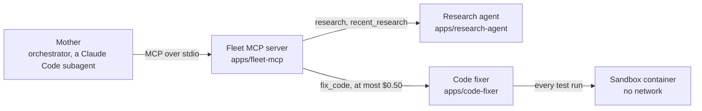

# The Year of AI

Judd Gurtman · [juddgurtman.com](https://juddgurtman.com)

This is where I build AI agents in public, one project at a time. Each app in `apps/` stands alone, with its own setup, offline tests, design notes and write-up. When I report a result, I name the saved run it came from.

I build them with Claude Code, which does most of the typing. Decisions that were mine:

- What to build, and which problems were worth fixing.
- For the code fixer, the design, the eval, the held-out cases, and every call about what counts as fixed.
- Running its held-out set only once, after all tuning. When hidden tests later showed one of its fixes had patched the caller instead of the cause, I chose to report 9 of 10 rather than the 10 of 10 it scored when it ran.
- Opus 5.5 as the fixer's default model, with Sonnet 5.5 as the comparison.
- Coach's control user, who changes only one thing: the same ten days without the knee injury.

## The projects

| Project | What it does | Measured result, with its run | Status | Links |
|---|---|---|---|---|
| **Code fixer** | Takes a small Python repo whose tests fail and hands back a patch, checked by a fresh test run in a locked-down container | **9 of 10** held-out bugs fixed, at $0.078 a fix. The set ran once, after all tuning, and it's only 10 cases. (Runs [`eval-20261002-131217`](apps/code-fixer/sample-runs/eval-20261002-131217/) and [`-155904`](apps/code-fixer/sample-runs/eval-20261002-155904/), re-graded with hidden tests in [`regrade-20261005-104714`](apps/code-fixer/sample-runs/regrade-20261005-104714/)) | Ship #3, 2026-10-02 | [README](apps/code-fixer/README.md) · [design](apps/code-fixer/DESIGN.md) · [write-up](apps/code-fixer/WRITEUP.md) · [post](https://www.linkedin.com/feed/update/urn:li:activity:7512931554109685760/) |
| **Research agent** | Splits a question into parts, researches them with parallel web-search workers, checks each claim against its quote, and writes a brief where every sentence cites a source | **"Partial" verdicts fell from 66% to 54%** of the same 116 claims once it recovered cut-off quotes ([`revalidate-20261004-140048`](apps/research-agent/sample-runs/revalidate-20261004-140048/)). A full brief costs $1.25 (`20260928-092603`). I haven't checked the validator against human labels yet. | Ship #2, 2026-09-28 | [README](apps/research-agent/README.md) · [design](apps/research-agent/DESIGN.md) · [write-up](apps/research-agent/WRITEUP.md) · [example brief](apps/research-agent/examples/ai-scribes.md) |
| **Coach** | A phone-first AI personal trainer that logs workouts, meals and weigh-ins through tools and writes each day's session from your logged loads | **13 of 13 checks** in 3 of the last 5 simulated ten-day runs, with 12 and 9 in the other two. Those runs cost $1.23 to $1.35 each, except run 14 at $0.81, which lost most of day 1. The first version scored 7 of 13 for $2.07. (`sim-20260928-155554`, `-190640` to `-193316`) All of it comes from one scripted user. | Ship #1, 2026-09-28. It's single-user, so there's no public demo, and I haven't evaluated real use yet | [README](apps/health-coach/README.md) · [design](apps/health-coach/DESIGN.md) · [write-up](apps/health-coach/WRITEUP.md) |
| **Fleet MCP server** | Hands the research agent and the code fixer to an orchestrator as MCP tools, with spending caps the server enforces | Nothing of its own yet. The costs it reports come from the agents' saved runs | Runs locally, not on the MCP registry | [README](apps/fleet-mcp/README.md) |

Most run folders stay on my machine. The ones behind the code fixer's held-out score and the research agent's replay are in each app's `sample-runs/`, so you can check those numbers yourself. The first paragraph of each project's README says where its number falls short.

Coach took about seven weeks to build, but it's older than this repo: I committed it in one go on 2026-09-27, so its ship date is just when it reached GitHub. That's why three ships land within a week. The research agent shipped on 2026-09-28, and I built the code fixer from 2026-09-30 to 10-02, with Claude Code doing most of the typing.

## How the fleet fits together

Mother is my orchestrator. It's a Claude Code subagent, and its definition and the fleet's shared notes stay on my machine. It reaches each agent through one MCP server, which runs the agent's command line in its own environment and passes back a single JSON result: `{agent, status, output, error, cost_usd, seconds, artifacts}`. Coach is a standalone web app outside the fleet.

## How I work

- I count causes before I pick a fix. With the research agent, counting showed that the fix I'd planned was aimed at the wrong cause.
- Numbers only go in if I measured them, and each one names its run. If I can't trace a result to a saved run, it comes out, and when a rerun disagrees, the new number replaces the old one everywhere.
- I don't take the model's word for anything. A fix counts when a fresh sandbox run passes, and something counts as logged when a tool call actually saved it.
- When a review catches a mistake, it becomes a rule in [CLAUDE.md](CLAUDE.md#rules-learned-the-hard-way) so it doesn't happen twice. There are 32 so far, and most come with the incident that taught them.

## What I'd do with another month

- **Code fixer:** I'd run each setup several times and report the spread, then try it on bugs I didn't pick. Ten cases run once can't separate setups that differ by one case.
- **Research agent:** Hand-labeling about 100 claim and quote pairs would show how often the validator agrees with me. Until I do that, its verdicts are only the model's call.
- **Coach:** Its only systematic test so far is one scripted user, so I'd use it myself for a month and score my real logs with the same checks.
- **Fleet MCP server:** Publishing it to the MCP registry would let something besides my own orchestrator call it. I'd write a proper security section first.

The plan and the shipping log are in [curriculum/](curriculum/).
