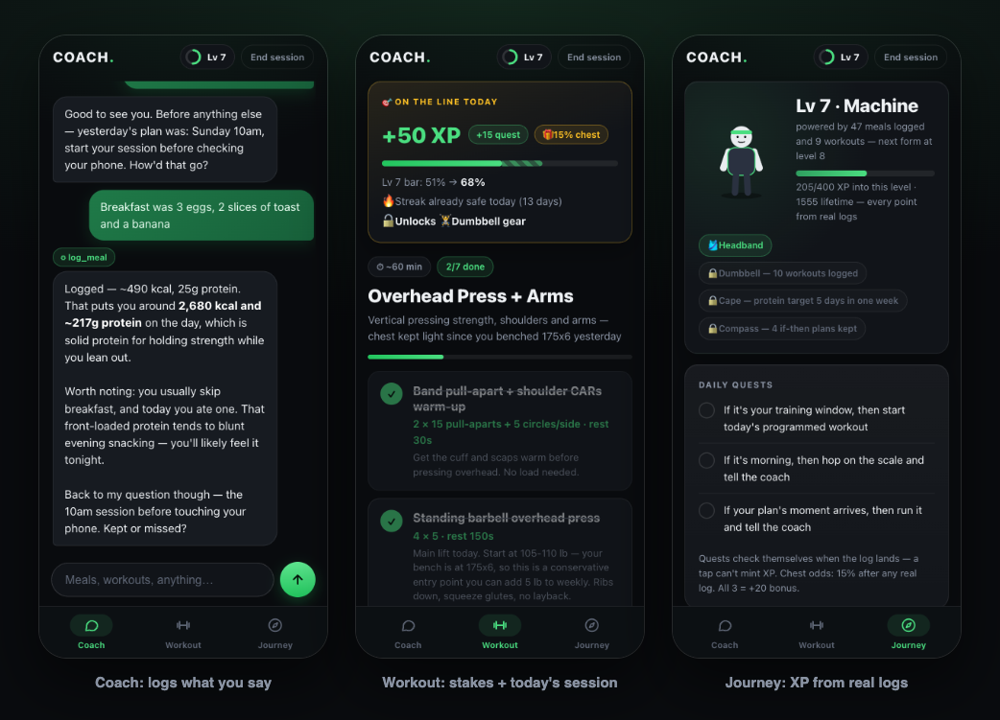

# Coach: an AI personal trainer that remembers you

A phone-first web app where you talk to a coach in plain English and it **takes real actions**: logs workouts, meals (it estimates calories and protein itself), weigh-ins and if-then plans; programs your week; and writes today's session from your actual logged loads. A game layer (XP, levels, quests, gear) rewards only what's in your logs, so a tap can never mint progress.

Project #1 of my Year of AI. Built with the Claude API, FastAPI and one HTML file.



## What it does

- **Coach tab.** A motivational-interviewing coach with memory. It runs a structured intake (safety screen first), then logs whatever you tell it through tools: `log_workout`, `log_meal`, `log_weight`, `save_note`, `save_profile`, `save_plan`, `mark_plan_kept`.
- **Workout tab.** A weekly program built from your profile, and today's session written with progressive overload from your logged numbers. "Different workout" swaps in a genuinely different session. Form videos play in-app, ranked for relevance, with "try another" if the pick is off. A stakes banner shows what finishing is worth before you start.
- **Journey tab.** Level and avatar, daily quests that verify themselves against your logs, streak with a weekly rest-day shield, protein ring, weekly goals, weight trend, habit-automaticity meters, trophies.

## How it works

| File | Role |
|---|---|
| `coach.py` | **The engine.** System prompt, tool definitions, and the agent loop: the model decides, calls a tool, reads the result, continues. Also a terminal version: `python coach.py`. |
| `app.py` | **API + game.** FastAPI routes, the password gate, workout programming with structured outputs, and XP computed from the log files on every request (never stored as a counter). |
| `index.html` | **The skin.** Plain HTML/CSS/JS; every decision is made server-side. |
| `data/` | Your logs as markdown files. Git-ignored: your health data never leaves your machine or server. |

## Run it locally

Needs Python 3.10+ and an [Anthropic API key](https://console.anthropic.com/settings/keys).

```bash
cd apps/health-coach
python3 -m venv .venv && .venv/bin/pip install -r requirements.txt
cp .env.example .env          # paste your ANTHROPIC_API_KEY
.venv/bin/uvicorn app:app --reload
# open http://localhost:8000
```

For in-app form videos, add a `YOUTUBE_API_KEY`: a Google Cloud **API key starting with `AIza`** with *YouTube Data API v3* enabled. Keys from Google AI Studio start with `AQ.` and YouTube rejects them.

## Put it on your phone (Railway)

The app is single-user: one password, one person's data.

1. Push the repo to GitHub, then on [railway.com](https://railway.com): **New Project → Deploy from GitHub repo**.
2. In the service's **Settings**, set **Root Directory** to `apps/health-coach` (it picks up `railway.json`).
3. **Variables:** `ANTHROPIC_API_KEY`, `YOUTUBE_API_KEY` (optional), `APP_PASSWORD` (use a long passphrase), `TZ` (e.g. `America/Detroit`), `DATA_DIR=/data`.
4. **Add a volume** mounted at `/data`, or every redeploy wipes your logs.
5. **Settings → Networking → Generate Domain.** On iPhone, open it in Safari, sign in, then **Share → Add to Home Screen**.

Every `git push` redeploys. Railway's Hobby plan is $5/month including $5 of usage, which a single-user app like this fits within.

## Cost and safety

- Every coach message, "Different workout", and weekly program is a Claude Opus call. Set a monthly spend limit in the Anthropic console.
- On a server, all routes sit behind the password (HttpOnly cookie, login rate limit). Every API call also requires an `X-Coach` header, so other sites can't trigger paid requests.
- This is a coaching tool, not medical advice.

## What I learned

See [WRITEUP.md](WRITEUP.md): what broke, what the agent loop taught me, and why XP must be derived from logs.

## License

[MIT](LICENSE)
